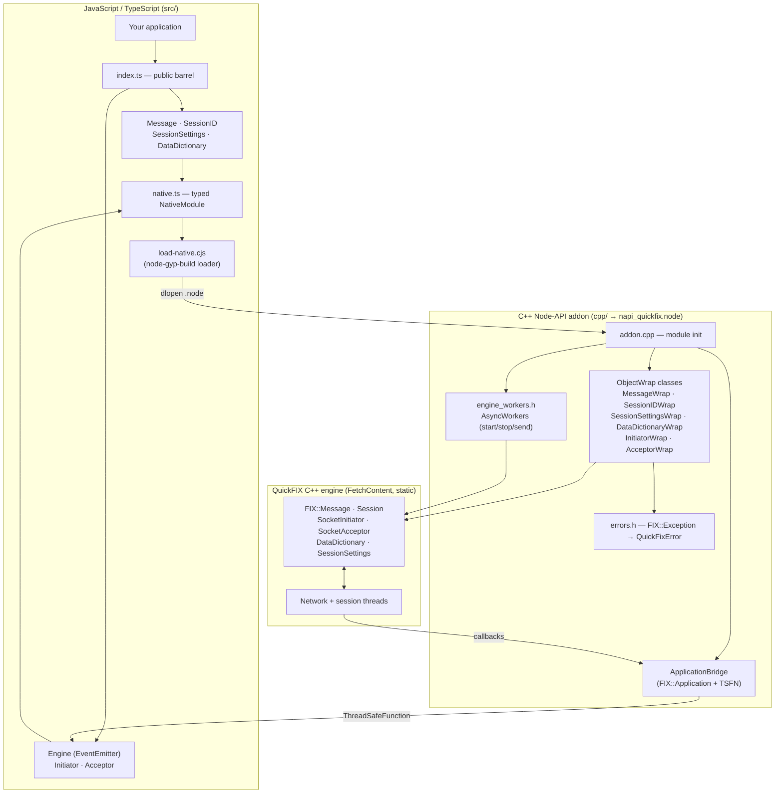
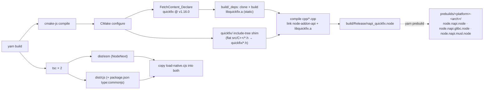
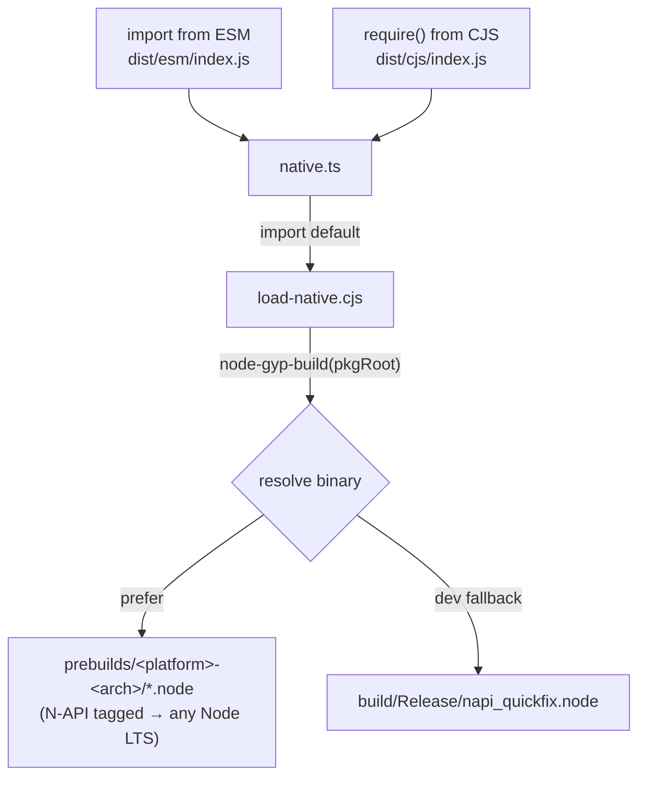
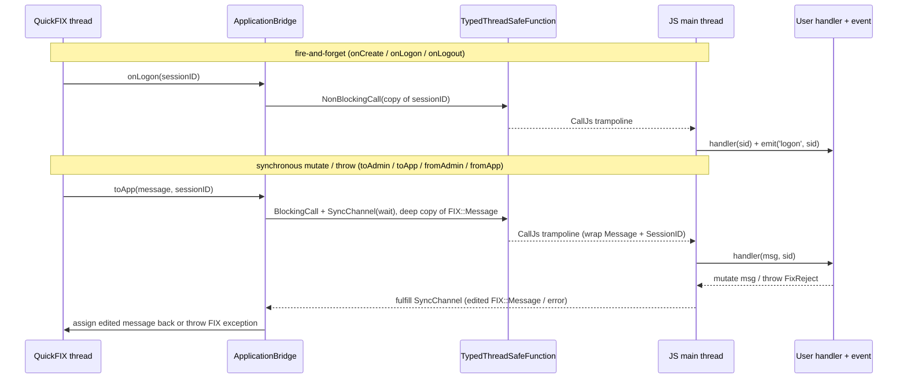
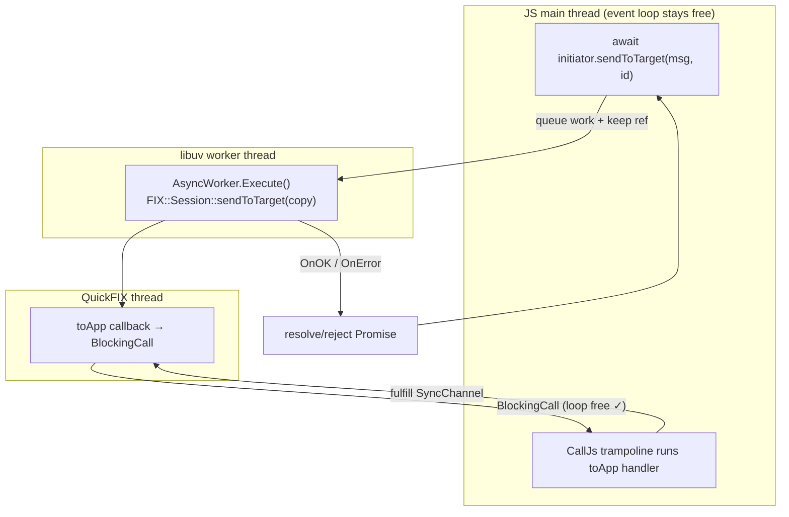
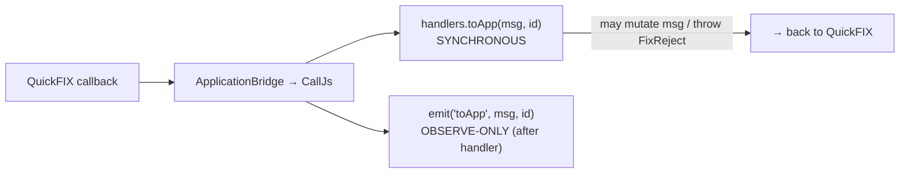
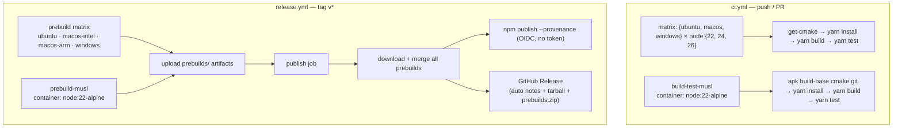

# Architecture

`@homaiohq/napi-quickfix` is a Node.js binding for the [QuickFIX](https://github.com/quickfix/quickfix)
C++ FIX-protocol engine. It has three layers — a **TypeScript public API**, a **C++ Node-API addon**, and the
**QuickFIX engine** (fetched at build time, never vendored) — glued together by a native binary that is prebuilt so
end users need no compiler.

- **Language boundary:** TypeScript ⇄ C++ via [node-addon-api](https://github.com/nodejs/node-addon-api) (N-API v9).
- **Build:** [cmake-js](https://github.com/cmake-js/cmake-js) + CMake `FetchContent` (pins QuickFIX `v1.16.0`).
- **Distribution:** prebuilt `.node` binaries loaded at runtime by
  [node-gyp-build](https://github.com/prebuild/node-gyp-build); dual **ESM + CJS** output.
- **Threading:** blocking engine calls run off the main thread (`AsyncWorker`); QuickFIX callbacks marshal back to JS
  through a `TypedThreadSafeFunction`.

---

## 1. Layered overview

The TypeScript layer is a thin, ergonomic facade. Each TS class holds an opaque handle to its C++ `ObjectWrap`
counterpart. The C++ layer owns the QuickFIX objects and translates every exception into a JS `QuickFixError`
(with a stable `.fixErrorName` discriminator).

---

## 2. Build pipeline

Nothing from QuickFIX is committed. CMake fetches and statically links it at build time; the result is a single
`.node` binary. End users install a **prebuilt** binary and skip this entirely.

Key detail: QuickFIX ships headers **flat** in `src/C++/*.h` but code includes them as `quickfix/Message.h`, so
`CMakeLists.txt` copies them into a generated `quickfix/` include tree at configure time (Windows-safe, no symlinks).

---

## 3. Module loading (dual ESM + CJS)

The loader is one authored `.cjs` file copied into both build outputs, so ESM and CJS resolve the exact same binary
from the package root. The `napi` tag means a single prebuild per platform serves Node 22, 24 and 26.

---

## 4. The Application bridge (C++ threads → JS)

QuickFIX invokes `FIX::Application` callbacks from its **own network/session threads**. `ApplicationBridge`
subclasses `FIX::Application` and forwards each callback to JS through a single `Napi::TypedThreadSafeFunction`.

- **Fire-and-forget** callbacks never block the QuickFIX thread.
- **Synchronous** callbacks (which may mutate the outbound message or throw to reject) use a `BlockingCall` plus a
  shared `SyncChannel` (mutex + condition variable). An RAII guard **always** fulfils the channel — even if the JS
  handler throws — so the QuickFIX thread can never deadlock waiting on it.
- The message crosses the bridge as a **deep copy of the `FIX::Message`** in both directions, never as a wire
  string. A string re-parse would need the session's data dictionary to rebuild repeating groups, and would re-sort
  the body numerically; the copy keeps groups and the sender's field order byte-for-byte.

### Field order

QuickFIX sorts every `FieldMap` with a `message_order` fixed at construction (numeric for a body, dictionary order
for a group). `MessageWrap` and `GroupWrap` keep **insertion order** instead: before a new tag is set they rebuild
the map with a `group`-mode order listing the existing tags in their current sequence plus the new one
(`cpp/field_map_util.h`). Existing tags are overwritten in place. A `Group` always puts its delimiter first and
honours an optional pinned order given at construction. Messages produced by a parse keep QuickFIX's parse order.
The rebuild is skipped, leaving QuickFIX's own insertion, when the map cannot be expressed as a tag-keyed order:
a tag outside `1..100000` (the order array is indexed by tag, so a parsed negative or huge tag would write out of
bounds or allocate gigabytes), a repeated flat tag (a group parsed without a dictionary; duplicates would collapse),
or a parse flagged as structurally invalid.

---

## 5. Why `start` / `stop` / `sendToTarget` are async

These calls make QuickFIX invoke synchronous callbacks that must round-trip to the JS main thread. If they ran **on**
the main thread, the main thread would block waiting for a `BlockingCall` that only the (now-blocked) event loop can
service — a deadlock. The fix: run the blocking QuickFIX call on a libuv worker thread via `Napi::AsyncWorker` and
return a `Promise`, keeping the event loop free to run the bridge trampoline.

Synchronous, non-blocking members stay sync: `isLoggedOn()`, `ref()`, `unref()`, and the entire pure layer
(`Message`, `SessionID`, `SessionSettings`, `DataDictionary`). On GC/process exit, a cleanup hook deactivates the
bridge and force-stops the engine **before** the TSFN is torn down, so a live session never crashes on shutdown.

---

## 6. Handlers vs. events

Each engine exposes two channels for the same callbacks — with different contracts:

- **`handlers`** run synchronously inside the callback and can mutate outbound messages or `throw new FixReject(...)`
  to reject inbound ones (mapped to `DoNotSend` / `RejectLogon` / `UnsupportedMessageType`).
- **Events** are emitted afterward for observation (logging, metrics) and cannot affect the FIX flow.

---

## 7. CI / release

Because binaries are N-API-tagged, one prebuild per platform/arch covers every supported Node LTS. Publishing uses
npm **trusted publishing** (OIDC) — no long-lived token.

The musl jobs are deliberately **separate jobs** rather than matrix entries: they need a container and a different step
list (no `setup-node`, which would install a glibc Node; no `lukka/get-cmake`, whose Kitware binaries are glibc-only —
CMake comes from `apk`). Note that `runner.os` is `Linux` for both the glibc and musl jobs, so their cache keys carry a
**front-loaded** `musl-` discriminator (`cmake-deps-musl-Linux-…`). Front-loaded, not suffixed: `build/_deps` holds a
compiled `libquickfix.a`, and as a suffix the glibc job's `restore-keys: cmake-deps-Linux-` would still prefix-match the
musl entries and link musl objects into a glibc addon.

---

## Source map

| Area | Files |
| --- | --- |
| Public TS API | `src/index.ts`, `message.ts`, `session-id.ts`, `session-settings.ts`, `data-dictionary.ts`, `enums.ts` |
| Engine + handlers | `src/engine.ts`, `initiator.ts`, `acceptor.ts`, `application.ts` |
| Native loader | `src/native.ts`, `src/load-native.cjs` |
| Addon entry / wraps | `cpp/addon.cpp`, `cpp/*_wrap.{h,cpp}`, `cpp/session_static.cpp`, `cpp/enums.cpp` |
| Bridge / async / errors | `cpp/application_bridge.{h,cpp}`, `cpp/engine_workers.h`, `cpp/errors.h` |
| Build / dist | `CMakeLists.txt`, `scripts/prebuild.mjs`, `tsconfig.*.json`, `package.json` |
| Tests | `test/*.test.ts` |
| CI | `.github/workflows/ci.yml`, `.github/workflows/release.yml` |
