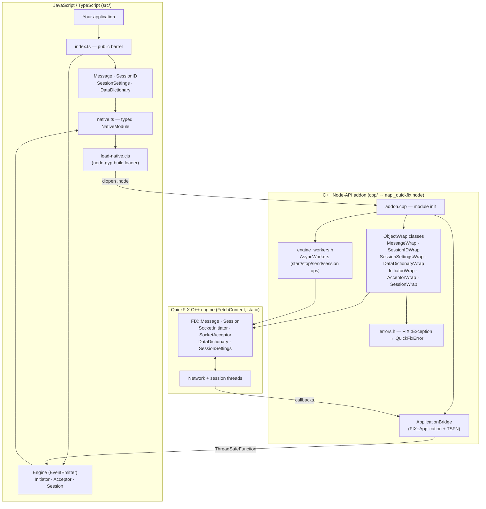
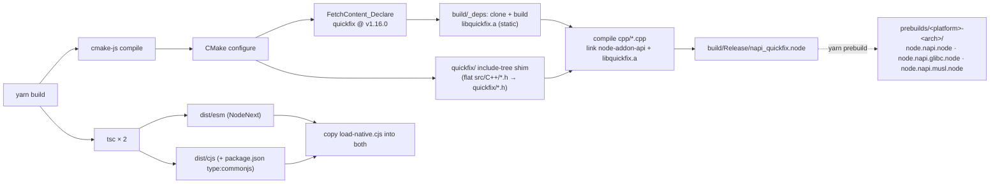
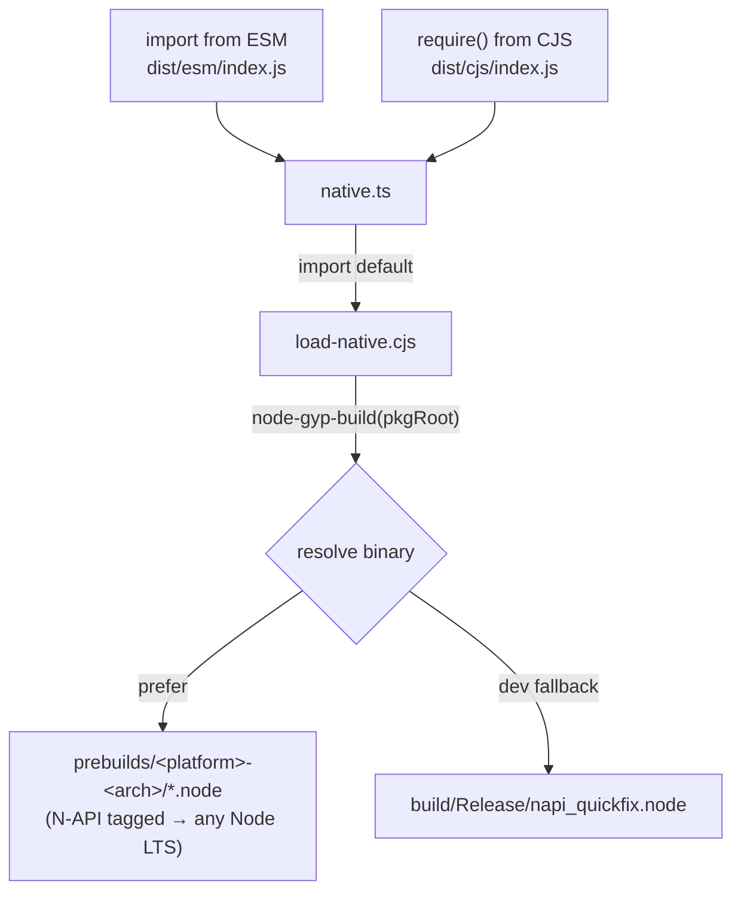
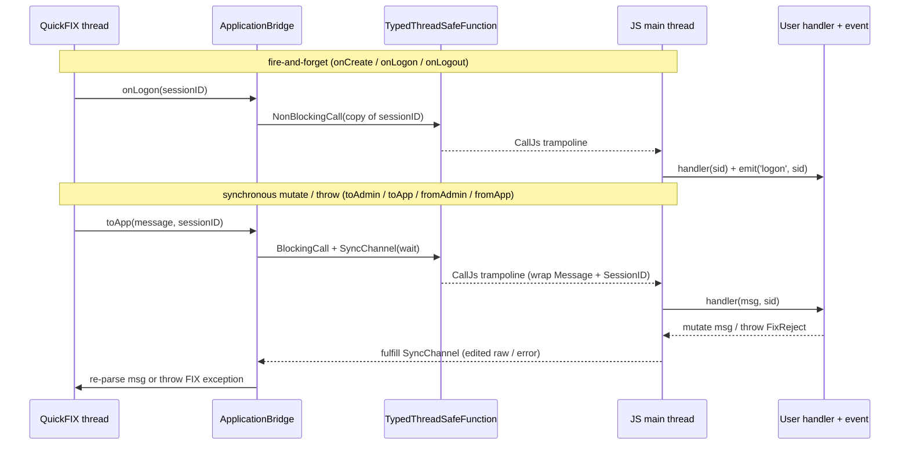
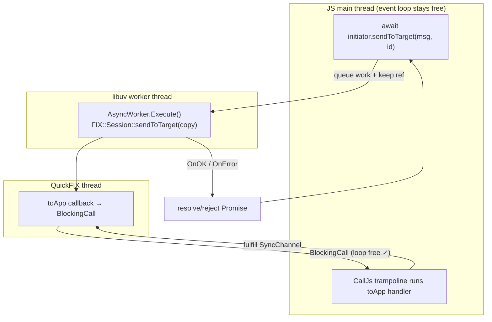
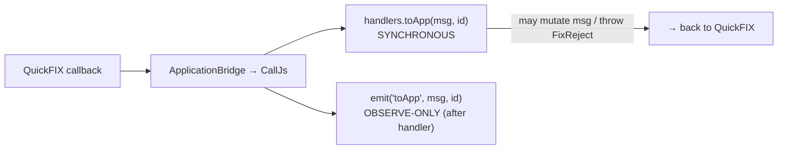
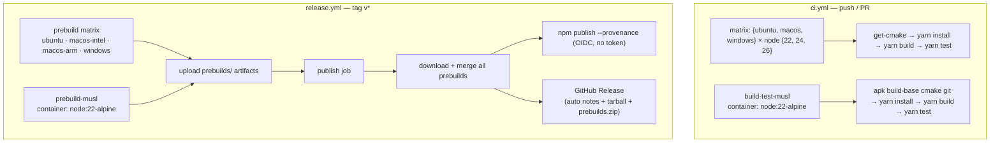

# Architecture

`@homaiohq/napi-quickfix` is a Node.js binding for the [QuickFIX](https://github.com/quickfix/quickfix)
C++ FIX-protocol engine. It has three layers — a **TypeScript public API**, a **C++ Node-API addon**, and the
**QuickFIX engine** (fetched at build time, never vendored) — glued together by a native binary that is prebuilt so
end users need no compiler.

- **Language boundary:** TypeScript ⇄ C++ via [node-addon-api](https://github.com/nodejs/node-addon-api) (N-API v9).
- **Build:** [cmake-js](https://github.com/cmake-js/cmake-js) + CMake `FetchContent` (pins QuickFIX `v1.16.0`).
- **Distribution:** prebuilt `.node` binaries loaded at runtime by
  [node-gyp-build](https://github.com/prebuild/node-gyp-build); dual **ESM + CJS** output.
- **Threading:** blocking engine calls run off the main thread (`AsyncWorker`); QuickFIX callbacks marshal back to JS
  through a `TypedThreadSafeFunction`.

---

## 1. Layered overview

The TypeScript layer is a thin, ergonomic facade. Each TS class holds an opaque handle to its C++ `ObjectWrap`
counterpart. The C++ layer owns the QuickFIX objects and translates every exception into a JS `QuickFixError`
(with a stable `.fixErrorName` discriminator).

---

## 2. Build pipeline

Nothing from QuickFIX is committed. CMake fetches and statically links it at build time; the result is a single
`.node` binary. End users install a **prebuilt** binary and skip this entirely.

Key detail: QuickFIX ships headers **flat** in `src/C++/*.h` but code includes them as `quickfix/Message.h`, so
`CMakeLists.txt` copies them into a generated `quickfix/` include tree at configure time (Windows-safe, no symlinks).

---

## 3. Module loading (dual ESM + CJS)

The loader is one authored `.cjs` file copied into both build outputs, so ESM and CJS resolve the exact same binary
from the package root. The `napi` tag means a single prebuild per platform serves Node 22, 24 and 26.

---

## 4. The Application bridge (C++ threads → JS)

QuickFIX invokes `FIX::Application` callbacks from its **own network/session threads**. `ApplicationBridge`
subclasses `FIX::Application` and forwards each callback to JS through a single `Napi::TypedThreadSafeFunction`.

- **Fire-and-forget** callbacks never block the QuickFIX thread.
- **Synchronous** callbacks (which may mutate the outbound message or throw to reject) use a `BlockingCall` plus a
  shared `SyncChannel` (mutex + condition variable). An RAII guard **always** fulfils the channel — even if the JS
  handler throws — so the QuickFIX thread can never deadlock waiting on it.

---

## 5. Why `start` / `stop` / `sendToTarget` are async

These calls make QuickFIX invoke synchronous callbacks that must round-trip to the JS main thread. If they ran **on**
the main thread, the main thread would block waiting for a `BlockingCall` that only the (now-blocked) event loop can
service — a deadlock. The fix: run the blocking QuickFIX call on a libuv worker thread via `Napi::AsyncWorker` and
return a `Promise`, keeping the event loop free to run the bridge trampoline.

Synchronous, non-blocking members stay sync: `isLoggedOn()`, `getSessions()`, `getSession()`, `ref()`, `unref()`,
and the entire pure layer (`Message`, `SessionID`, `SessionSettings`, `DataDictionary`). On GC/process exit, a
cleanup hook deactivates the bridge and force-stops the engine **before** the TSFN is torn down, so a live session
never crashes on shutdown.

### `Session`: which members are async, and why

`SessionWrap` is a handle on an engine-owned `FIX::Session`. The rule for its sync/async split is the lock, not the
I/O: **QuickFIX holds `Session::m_mutex` while it runs application callbacks** (`sendRaw` holds it across
`toAdmin`/`toApp`; `disconnect` holds it across `onLogout`). A QuickFIX thread blocked in one of those callbacks is
waiting on the JS event loop via a `BlockingCall`, so any main-thread call that takes `m_mutex` would wait on a
thread that is waiting on the main thread — deadlock.

| Members | Thread | Why |
| --- | --- | --- |
| `isLoggedOn` · `isEnabled` · `sentLogon` · `sentLogout` · `receivedLogon` · `isInitiator` · `isAcceptor` · `isSessionTime` · `isLogonTime` · option getters/setters | sync, main | Read/write plain members of `FIX::Session`; no lock, no callback. |
| `getExpectedSenderNum` · `getExpectedTargetNum` · `setNextSenderMsgSeqNum` · `setNextTargetMsgSeqNum` | sync, main | Touch the `MessageStore` under `SessionState`'s own mutex, which QuickFIX never holds across a callback. May throw `IOException` (mapped to `QuickFixError`). |
| `reset` · `disconnect` | **async, `SessionOpWorker`** | Take `m_mutex` **and** fire `toAdmin` (`reset` sends a Logout) / `onLogout` through the TSFN — the deadlock case above. |
| `logon` · `logout` · `refresh` | **async, `SessionOpWorker`** | Don't take `m_mutex` today, but they are state transitions whose effect is only observable through `'logon'`/`'logout'` events; they share the async shape so the control surface is uniform and robust to upstream locking changes. |

**Lifetime.** `FIX::Session` objects are owned by the engine and `FIX::Session::lookupSession` returns a raw,
non-owning pointer, so `SessionWrap` never caches it: it stores the `FIX::SessionID` by value and re-resolves on
**every** call (on the worker thread for async ops), throwing/rejecting `QuickFixError{fixErrorName:
'SessionNotFound'}` when the session is gone. QuickFIX only deletes sessions — and removes them from the registry
`lookupSession` reads — in the engine destructor, so `InitiatorWrap`/`AcceptorWrap` destroy their engine as soon
as `stop()` settles (all network threads are joined by then) rather than waiting for GC. That is what makes a stale
`Session` handle fail deterministically after `stop()`, and lets a new engine reuse the same `SessionID`s
immediately instead of hitting a "Duplicate Session" `ConfigError`.

That eager destruction races with the worker-thread operations above, which hold a raw `FIX::Session*` between
`lookupSession` and the end of the operation. `session_op_gate.h` closes the race with a process-wide gate:
`SessionOpWorker` / `SendToTargetWorker` hold a `SessionOpGate::OpScope` for their whole `Execute()`, and the
engine's stop worker — on its **own** libuv thread, after `stop()` has joined the network threads — calls
`SessionOpGate::Freeze()`, which blocks new operations and waits for the in-flight ones to drain. Only then does
`OnOK` destroy the engine on the JS thread and `Unfreeze()`. Waiting on the worker thread rather than in `OnOK`
matters: an in-flight `reset()` may be blocked in a `toAdmin` `BlockingCall`, which needs the JS loop free. A
never-started engine takes the same async path on `stop()`, since its sessions are registered from construction.
The wrap destructor also freezes before destroying the engine, but only after `Teardown()` has deactivated the
bridge, so no in-flight operation can be waiting on the (blocked) JS thread.

Until `stop()` settles the engine is alive on the JS thread, so `engine.getSession()` / `engine.isLoggedOn(id)`
keep answering during a graceful stop (a `'logout'` listener can still read the final sequence numbers).

---

## 6. Handlers vs. events

Each engine exposes two channels for the same callbacks — with different contracts:

- **`handlers`** run synchronously inside the callback and can mutate outbound messages or `throw new FixReject(...)`
  to reject inbound ones (mapped to `DoNotSend` / `RejectLogon` / `UnsupportedMessageType`).
- **Events** are emitted afterward for observation (logging, metrics) and cannot affect the FIX flow.

---

## 7. CI / release

Because binaries are N-API-tagged, one prebuild per platform/arch covers every supported Node LTS. Publishing uses
npm **trusted publishing** (OIDC) — no long-lived token.

The musl jobs are deliberately **separate jobs** rather than matrix entries: they need a container and a different step
list (no `setup-node`, which would install a glibc Node; no `lukka/get-cmake`, whose Kitware binaries are glibc-only —
CMake comes from `apk`). Note that `runner.os` is `Linux` for both the glibc and musl jobs, so their cache keys carry a
**front-loaded** `musl-` discriminator (`cmake-deps-musl-Linux-…`). Front-loaded, not suffixed: `build/_deps` holds a
compiled `libquickfix.a`, and as a suffix the glibc job's `restore-keys: cmake-deps-Linux-` would still prefix-match the
musl entries and link musl objects into a glibc addon.

---

## Source map

| Area | Files |
| --- | --- |
| Public TS API | `src/index.ts`, `message.ts`, `session-id.ts`, `session-settings.ts`, `data-dictionary.ts`, `enums.ts` |
| Generated FIX constants | `scripts/gen-fields.mjs` → `src/generated/fields.ts` (`FIELD`), `scripts/gen-values.mjs` → `src/generated/values.ts` (value groups, `VALUES`) — both from the QuickFIX headers at the pinned tag |
| Engine + handlers | `src/engine.ts`, `initiator.ts`, `acceptor.ts`, `application.ts` |
| Per-session control | `src/session.ts` (`Session`, `lookupSession`, `doesSessionExist`, `getSessions`, `numSessions`), `cpp/session_wrap.{h,cpp}` |
| Native loader | `src/native.ts`, `src/load-native.cjs` |
| Addon entry / wraps | `cpp/addon.cpp`, `cpp/*_wrap.{h,cpp}`, `cpp/session_static.cpp` (`sendToTarget` + session lookups) |
| Bridge / async / errors | `cpp/application_bridge.{h,cpp}`, `cpp/engine_workers.h` (`EngineOpWorker`, `SessionOpWorker`), `cpp/errors.h` |
| Build / dist | `CMakeLists.txt`, `scripts/prebuild.mjs`, `tsconfig.*.json`, `package.json` |
| Tests | `test/*.test.ts`, `test/helpers.ts` (loopback harness) |
| CI | `.github/workflows/ci.yml`, `.github/workflows/release.yml` |
